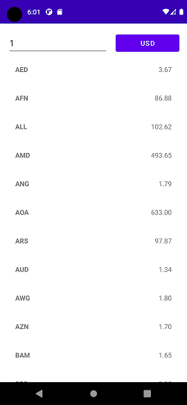
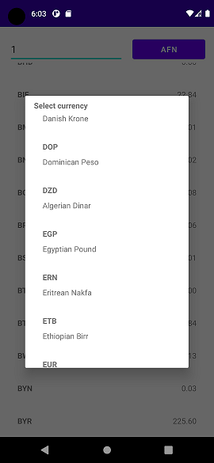
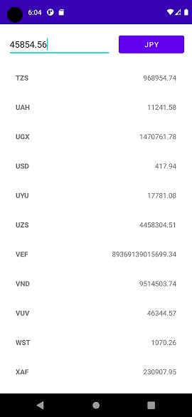

# Currency converter

> A simple Android currency conversion app using MVVM architecture

## Description 

- This app allows it's users to convert amounts from any currency to any other. For example : convert 45 USD to all of the other currencies (CAD, JPY, AUD, etc). The results of the conversion will be displayed in a vertical RecyclerView showing the name of the currency and the value of the conversion.

## Screenshots

## Technologies used

- Dependency Injection with Dagger
- Unit Testing with JUnit and Google Truth
- Android Room for data persistence and offline use
- Databinding for XML Layouts
- MVVM Architecture with LiveData

## Project Structure

